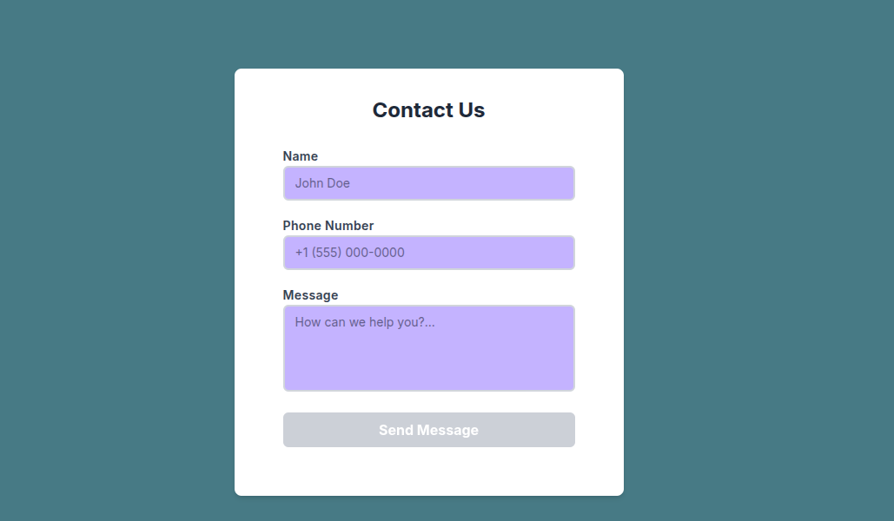
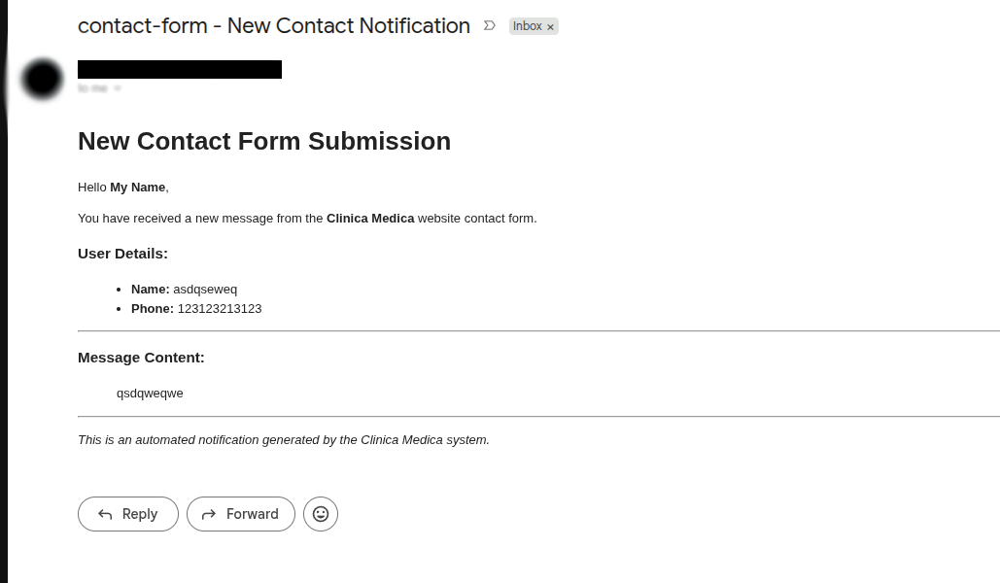
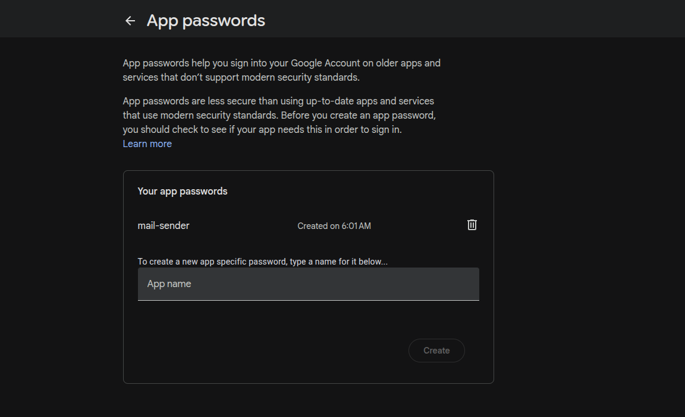

# Simple Contact Form

An automated full-stack with spring boot and angular, contact form application designed to capture user messages and send automated email notifications.



## Features

- **Automated Mailing:** Captures form submissions and routes them to a designated admin email.
    
- **Custom Email Templates:** Supports highly customizable email bodies using `.md` (Markdown) or `.html` formats alongside variable injection (`.csv` or `.txt`).
    
- **Dynamic Security & Telemetry:** * Automatically configures **SSL/HTTPS** via Certbot if domain and email variables are provided.
    
    - Automatically provisions **Grafana Alloy** for telemetry and logging if Grafana credentials are provided.
        
- **Infrastructure as Code (IaC):** Fully automated AWS provisioning using Terraform.
    
- **CI/CD Ready:** Automated testing, security scanning, and deployment via CircleCI.

## Tools

- **Infrastructure & DevOps:** Terraform, Docker Compose, CircleCI, `mise` (Task Runner)
    
- **Testing & Telemetry:** Mailpit (Local SMTP testing), Grafana Alloy (Observability)


## Environment Configuration

Create a `.env` file in the root of your project. The deployment script dynamically adapts to the variables provided. If SSL or Grafana variables are left blank, the deployment pipeline will safely skip those configuration steps.

Code snippet

```
# AWS Credentials
AWS_ACCESS_KEY_ID="_ACCESS_KEY"
AWS_SECRET_ACCESS_KEY="_SECRET_KEY"
AWS_REGION="us-east-1"

# Grafana Telemetry (Optional - Leave blank to disable Alloy)
GRAFANA_PROMETHEUS_URL=
GRAFANA_PROMETHEUS_USER_ID=
GRAFANA_PROMETHEUS_TOKEN=
GRAFANA_LOKI_URL=
GRAFANA_LOKI_USER_ID=
GRAFANA_LOKI_TOKEN=

# Domain & Security (Optional - Leave blank to deploy on HTTP port 80)
MAIL_SSL=
DOMAIN_SSL=

# Application & Database Settings
PROFILE=prod
FORM_PORT=8000
ALLOWED_ORIGINS=
DB_USER=user
DB_PASSWORD=password

# Mail Server Configuration
MAIL_HOST=localhost
MAIL_PORT=1025
MAIL_USERNAME=username
MAIL_PASSWORD=password
ADMIN_MAIL=admin@mail.com
```

To get the mail password you must access the google app passwords and create a new application, get the generated application password on there and use on the .env variables.




## Local Development

### Prerequisites

This project utilizes [mise](https://mise.jdx.dev/) to manage tooling versions (Maven, Node, Bun, Terraform) and run routine tasks.

You can execute predefined tasks using `mise run <task_name>`:

- `terraform_init`: Initializes the Terraform working directory.
    
- `terraform_plan`: Generates and displays the infrastructure execution plan.
    
- `terraform_deploy`: Applies Terraform configurations and triggers the `deploy.sh` script.
    
- `terraform_run`: A full environment reset (Destroys, Plans, Applies, and Deploys).
    
- `docker_run`: Spins up local Docker services.
    
- `docker_stop`: Tears down local Docker services.
    

### Local Mail Testing (Docker)

For local development, the project includes a `docker-compose.yml` to run **Mailpit**, allowing you to safely test email routing without sending real emails. Start it using `mise run docker_run`.

## Customization & Constraints

The application logic provides global constraints that can be modified to suit your specific data requirements:

Java

```
public static final int MAX_NAME_LENGTH = 200;
public static final int MAX_PHONE_LENGTH = 80;
public static final int MAX_CONTENT_LENGTH = 4000;
public static final String[] TEMPLATE_FILE_EXTENSION = { ".md", ".html" };
public static final String[] VARIABLES_FILE_EXTENSION = { ".csv", ".txt" };
```

To update the default email format, modify the `template.md` (or `.html`) and link it to your `variables.txt` configuration.

## CI/CD Variables (CircleCI)

// need to fill

## CI/CD Pipeline (CircleCI)

The project includes a robust CircleCI pipeline (`.circleci/config.yml`) that strictly deploys from the `main` branch.

**Workflow Stages:**

1. **tf-security-scan:** Runs `tfsec` to scan Terraform code for security vulnerabilities.
    
2. **tf-plan:** Initializes, formats, and validates the Terraform plan.
    
3. **hold-for-approval:** A manual gatekeeper step requiring human approval before affecting live infrastructure.
    
4. **tf-apply:** Executes the approved Terraform plan and extracts the required SSH deployment keys.
    
5. **app-deploy:** Injects production environment variables, installs the Angular CLI, builds the applications, and executes the server deployment script (`deploy.sh`).


## License

**MIT License**

Copyright (c) 2026

Permission is hereby granted, free of charge, to any person obtaining a copy of this software and associated documentation files (the "Software"), to deal in the Software without restriction, including without limitation the rights to use, copy, modify, merge, publish, distribute, sublicense, and/or sell copies of the Software, and to permit persons to whom the Software is furnished to do so, subject to the following conditions:

The above copyright notice and this permission notice shall be included in all copies or substantial portions of the Software.

THE SOFTWARE IS PROVIDED "AS IS", WITHOUT WARRANTY OF ANY KIND, EXPRESS OR IMPLIED, INCLUDING BUT NOT LIMITED TO THE WARRANTIES OF MERCHANTABILITY, FITNESS FOR A PARTICULAR PURPOSE AND NONINFRINGEMENT. IN NO EVENT SHALL THE AUTHORS OR COPYRIGHT HOLDERS BE LIABLE FOR ANY CLAIM, DAMAGES OR OTHER LIABILITY, WHETHER IN AN ACTION OF CONTRACT, TORT OR OTHERWISE, ARISING FROM, OUT OF OR IN CONNECTION WITH THE SOFTWARE OR THE USE OR OTHER DEALINGS IN THE SOFTWARE.
